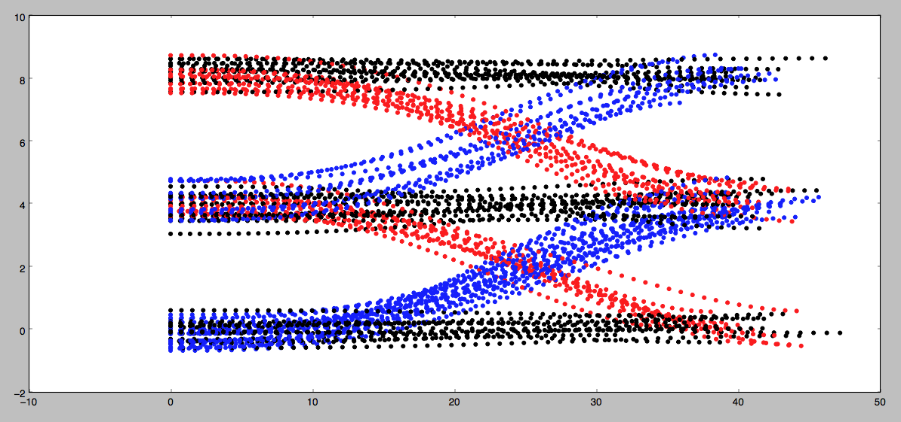

# Gaussian Naive Bayes Classifier

This implements a Gaussian Naive Bayes classifier in C++ and Python - to classify data for a Self-Driving Car. 

This project implements a Gaussian Naive Bayes classifier to predict the behavior of vehicles on a highway. In the image below you can see the behaviors you'll be looking for on a 3 lane highway (with lanes of 4 meter width). The dots represent the d (y axis) and s (x axis) coordinates of vehicles as they either...

- change lanes left (shown in blue)
- keep lane (shown in black)
- or change lanes right (shown in red)



The coordinates are in Frenet's coordinate system (s and d), not Cartesian coordinates, where s denotes distance along the road, and d denotes lateral displacement from the road.

Your job is to write a classifier that can predict which of these three maneuvers a vehicle is engaged in given a single coordinate (sampled from the trajectories shown below).

Each coordinate contains 4 pieces of information:

```
s
d
​s_dot (derivative of s)
​d_dot (derivative of d)
```

For example, here is some training data:

```
17.4315097932308,7.66663915727218,9.33174617750683,-1.18516657219584
22.1561095024838,0.227879223930593,11.5408197914272,-0.0904488856735072
17.2911040762026,6.74111195691705,9.92272107541862,-1.67616112578641
14.7673913109259,0.213767914986931,9.53029817853271,-0.00179248092166092

```
​​ 
You also know the lane width is 4 meters (this might be helpful in engineering features for your algorithm).

### Instructions
Implement the train(self, data, labels) and predict(self, observation) methods in the class GNB in classifier.cpp

When you want to test your classifier, run Test Run and check out the results.
NOTE: You are welcome to use some existing implementation of a Gaussian Naive Bayes classifier. But to get the best results you will still need to put some thought into what features you provide the algorithm when classifying. Though you will only be given the 4 coordinates listed above, you may find that by "engineering" features you may get better performance. For example: the raw value of the d coordinate may not be that useful. But d % lane_width might be helpful since it gives the relative position of a vehicle in it's lane regardless of which lane the vehicle is in.

### Results 

Using all the features (s, d, s_dot, d_dot) as-is, without any extra processing, we can achieve 84.4% accuracy on classification. The results are below.

```
X_train number of elements 750
X_train element size 4
Y_train number of elements 750
X_train Front element: 34.7681, 0.832914, 8.20664, -0.998961,
---- Training ----
Train: Features count:4
Unique labels:
keep has samples: 316
 Mean: 20.3242, 3.68024, 9.99854, 0.00581204,
 Std:  11.4363, 3.40382, 1.06863, 0.168126,
 Prob: 0.421333
left has samples: 214
 Mean: 19.7141, 5.05181, 9.91413, -0.967087,
 Std:  12.2899, 2.36011, 0.990239, 0.663282,
 Prob: 0.285333
right has samples: 220
 Mean: 19.4772, 2.93405, 9.94717, 0.954022,
 Std:  12.0855, 2.31228, 0.952085, 0.646845,
 Prob: 0.293333
--- End Training ---
X_test number of elements 250
X_test element size 4
Y_test number of elements 250
You got 84.4 % correct
```